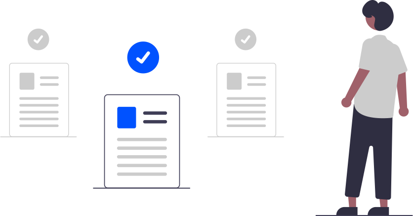

# LFC112 Course Notes: Creating Effective Documentation for Developers

This repo contains my personal notes and takeaways from **Creating Effective Documentation for Developers (LFC112)** by The Linux Foundation. I kept referring back to concepts from this course, so I wrote these summaries to solidify what I learned and share it with others who might find it useful.

The course targets developers, technical writers, and project maintainers who want to create better documentation for APIs and open source projects. Judy Bogart, the instructor, brings years of experience in technical writing and API documentation, and her practical approach really resonated with me. If you're struggling with documenting your code or working with technical writers, this course addresses many of the challenges you'll face.

I want to thank [Judy Bogart](https://www.linkedin.com/in/judy-bogart-977ba0/) for creating such a thoughtful course. Her insights into the collaboration between developers and technical writers showed me how much better documentation can be when done right. She breaks down complex topics in a way that feels approachable, even for someone like me who isn't a professional writer.

**Official course page**: [Creating Effective Documentation for Developers (LFC112)](https://training.linuxfoundation.org/training/creating-effective-documentation-for-developers-lfc112/)

## Table of Contents

1. [Course Overview](#1-course-overview)
2. [What Makes a Great API Reference](#2-what-makes-a-great-api-reference)
3. [Tools for Generating Documentation](#3-tools-for-generating-documentation)
4. [Working with Documentation Professionals](#4-working-with-documentation-professionals)

---

## 1. Course Overview

If you're new here, these notes build on each other naturally. Each section focuses on practical takeaways you can apply immediately to your own documentation projects. The course really changed how I think about documentation - from seeing it as a chore to understanding it as a critical part of making software accessible and usable.

---

## 2. What Makes a Great API Reference

After going through Judy Bogart's course, I realized how much I'd been taking API documentation for granted. Sure, I'd used plenty of APIs, but I never really thought about what made some references so much easier to work with than others.

The big insight for me was understanding that an API reference isn't just a code dump with descriptions tacked on. It's actually a language specification that needs to teach developers both syntax and semantics - not just how to structure a call, but what it actually does and why you'd want to use it.

### What Actually Needs Documentation

Judy breaks this down into two core concepts that clicked for me:

**Syntax** covers the structure - element names, parameter types, ordering requirements, and construction rules. This is the stuff that most generated docs handle pretty well automatically.

**Semantics** is about meaning - how elements relate to each other, what statements actually accomplish, and the context that makes everything make sense. This is where most API docs fall short, and it's usually what separates good documentation from frustrating documentation.

The course really drove home that developers need to understand nuances that aren't obvious from the code itself. I've definitely been guilty of writing descriptions like "name - The name of the widget" which tells you absolutely nothing useful.

### Better Descriptions Make All the Difference

One example from the course really stuck with me. Instead of that useless "name - The name of the widget" description, you could have any of these more helpful versions:

| Description | What it tells you |
|-------------|-------------------|
| A localizable display string | It's for user interfaces and needs translation support |
| An identifying string, unique within the scope of the request | It's a key that has to be unique, but only for this specific operation |
| A generated opaque identifier, as returned by the creation function | Don't try to parse it or create your own - use what the API gives you |

Each version gives you context about source, usage, and constraints that actually helps you use the element correctly.

### Context Without Clutter

The course emphasizes that API references need enough context to be useful, but they're not the place for tutorials or deep conceptual discussions. The reference should explain what the API does overall and what each major element accomplishes, but save the detailed examples and use cases for other documentation.

What I found helpful was Judy's approach to code examples - they should be snippets that show correct usage of specific elements, not full applications. The examples need introductory text that clearly explains what each one demonstrates.

### Different Types, Different Needs

The course covers three main API types, each with its own documentation requirements:

**Native-code APIs** (like Java or JavaScript libraries) need documentation for classes, methods, properties, top-level functions, and data structures. The complexity here is that these can be object-oriented or function-oriented, and you need to document instantiation, inputs, outputs, and allowed values.

**REST APIs** are what I work with most. The documentation needs to cover resources and endpoints, supported HTTP operations, request/response details for each operation, and complete data schemas. The OpenAPI specification has become pretty standard here.

**Command-line interfaces** need documentation for commands, arguments, options, and flags. Arguments are the variables, options are the optional parameters that change behavior, and flags are options that don't take parameters.

### Making Generated Docs Actually Useful

One thing that surprised me was how much you can improve generated documentation. Most tools are optimized for syntax representation, but you can and should add meaningful descriptions to the "description" fields they provide.

The course pointed out that even when engineers do add descriptions, they can almost always be improved. That's because developers are focused on implementation details rather than user experience, and they're usually not looking at the entire public API from a user's perspective.

For open source projects, Judy recommends encouraging documentation contributions from community members with writing skills, but you need clear policies about how to make changes that work with your generation process.

### The Bigger Picture

What I took away from this section is that good API reference documentation requires thinking like both a developer and a user. You need to understand the technical details well enough to be accurate, but you also need to step back and think about what someone who's never seen this code before would need to know to use it successfully.

The reference is often the first documentation produced for a new API, and for many developers (especially early adopters), it might be the only documentation they use. That puts a lot of pressure on getting it right, but following these principles makes a huge difference in how useful the documentation actually is.

---

## 3. Tools for Generating Documentation

Before taking this course, I thought documentation generation was pretty straightforward - run a tool on your code comments and get docs. Judy showed me how much more there is to it, and honestly, how much potential these tools have when you use them thoughtfully.

The basic idea is simple: tools extract structural information from your code and look for specially formatted comments to build documentation. But the quality depends entirely on how you configure the tool and how much descriptive content you actually provide in those comments.

### Making Your Code Self-Documenting

The key insight I got from the course is that documentation generation requires discipline. You have to add the right comments and tags to your source code, and it should be part of your code review process. It's not something you can bolt on afterward and expect good results.

For different languages, the source of structural information varies:

- **Compiled languages like C/C++**: Header files (*.h) define the structures and signatures
- **Interpreted languages like JavaScript**: The actual implementation files (*.js) contain everything
- **Java**: Source files like myClass.java provide the structural information

Tools like Doxygen, JavaDoc, and JSDoc all look for specially formatted comments on public elements. For REST APIs, tools like Swagger and Redoc work with YAML or JSON files that follow the OpenAPI specification.

### The Challenge for Open Source Projects

One thing Judy emphasized that I hadn't considered is how important it is to document your documentation process for open source projects. Contributors need to know:

- What tools you're using and how they're configured
- How to add comment infrastructure to new code
- How to add new files to the document generation setup
- Whether to edit source comments or generated files (spoiler: always the source)

I've definitely seen contributors accidentally edit generated HTML files, only to have their changes disappear the next time the generation job runs. Having clear contribution policies prevents this frustration.

### Going Beyond Basic Generation

Here's where the course really opened my eyes: basic generated documentation is usually pretty bare-bones. Most tools are optimized for syntax representation - they'll list parameter names, types, and allowed values automatically. But the semantic descriptions still have to be written by humans.

Even when engineers add descriptive comments, they can almost always be improved. The course points out that API developers are usually focused on implementation rather than user experience, and they're not looking at the entire public API from a newcomer's perspective.

If you want a professional writer to help improve the descriptions, they need access to the source code. Judy recommends finding technical writers who understand software development and can be trusted with the code, even if they're not expert programmers in your language.

### Adding the Missing Context

The biggest limitation of generated docs is that they can't create conceptual information from code comments alone. You have to explicitly add overview pages and introductions to the files your tool processes.

I found this approach really practical: create overview pages for each major class or resource that explain how, why, and when to use it. Include an index linking to the generated syntax pages, so it serves as both explanation and navigation.

You can also create entire additional documents (like conceptual guides and tutorials) in your markup format and configure the tool to include them alongside the generated content.

### Tools Worth Knowing About

The course covers quite a few tools, and I made notes on the ones that seem most relevant:

**For Native Code:**
- **Doxygen**: Works with C++, C, and several other languages. Supports multiple output formats
- **JavaDoc**: The standard for Java projects, generates HTML documentation
- **JSDoc**: Specifically designed for JavaScript's dynamic behavior

**For REST APIs:**
- **Swagger/OpenAPI tools**: Generate interactive documentation from API specifications
- **Redoc**: Creates clean, web-ready docs from OpenAPI descriptions
- **RapiDoc**: Adds interactive API testing capabilities

**Multi-purpose:**
- **Sphinx**: Python ecosystem tool that works with multiple markup languages
- **Read the Docs**: Hosting platform that integrates with generators and uses "docs as code"

### What I Learned About Tool Selection

The choice often comes down to your programming language, project needs, and team preferences. But Judy's advice is to explore and evaluate different tools based on your specific requirements rather than just going with the most popular option.

The key is understanding that these tools are starting points, not finished products. They give you a solid foundation for syntax documentation, but the semantic descriptions, conceptual overviews, and user-focused organization still require human input.

### Making It Work in Practice

What struck me most about this section was realizing that documentation generation is really about creating a sustainable process. The tools handle the repetitive work of formatting and keeping structure in sync with code changes. But the quality still depends on having good descriptions, clear examples, and thoughtful organization.

The best approach seems to be treating generated docs as one component of a larger documentation strategy, not as a complete solution. Use the tools for what they're good at, but don't expect them to solve all your documentation problems automatically.

---

## 4. Working with Documentation Professionals

This was probably the most eye-opening section of the course for me. As a developer, I'd always assumed that writing documentation was just part of the job - something you do alongside coding. Judy made a compelling case for why that approach often doesn't work well, and how collaboration with professional writers can make everyone more effective.

### Why Developers Struggle with Documentation

The course starts with an honest assessment: asking developers to document their own code has a real impact on development productivity. Writing code and writing natural language are different skills, and even developers with good communication abilities usually aren't familiar with the planning and organizational challenges of technical documentation.

More importantly, writing tasks are often at odds with coding responsibilities in terms of both task allocation and mindset. When you're deep in implementation details, it's hard to step back and think about what a new user needs to know.

The result is usually more efficient and higher quality when you assign documentation planning and production to technical communication professionals, with developers contributing technical information and reviewing drafts.

### Skills That Make Documentation Effective

Judy introduces two specific skill sets that technical writers develop:

**Knowledge engineering** - the ability to extract information from subject-matter experts and analyze it with the goal of communicating it clearly to others. This includes recognizing different types of knowledge (factual vs. procedural) and knowing how to elicit the right information.

**Information architecture** - organizing and presenting knowledge so it's accessible to different types of users. This means understanding when someone needs a reference table versus a tutorial, or how to structure information for different learning styles.

While some developers have excellent writing skills, this isn't their primary expertise, and they're usually fully occupied with building the software. The course argues it's more constructive to have professional writers and editors work with the development team.

### Making It Work in Open Source

For open source projects, Judy recommends actively recruiting community members with writing and editing skills. Writers need to know their contributions are valued, and engineers need to know these resources are available.

The key is framing documentation as a collaborative activity that benefits both sides. Writers improve their product knowledge by focusing on specific areas, and developers learn about the user perspective, which can actually improve their design choices.

### Planning a Documentation Suite

One insight that really changed how I think about documentation is the need for systematic planning. You need different documents for different types of users, addressing different goals with different kinds of information.

The planning process Judy outlines starts with thinking about what the documentation needs to accomplish:
- Attract users by explaining how your product helps them
- Make them successful by providing task-oriented information
- For open source, attract contributors by explaining how to join the project

Then you consider who your users are, their roles and workflows, and how they'll use your tools to accomplish specific goals.

### Document Specifications

For each document you decide to create, the course recommends writing a specification covering:

- **Project objectives**: How does this support your business/community needs?
- **Audience**: What type of user does this address?
- **Technical objectives**: What goals will this help readers accomplish?
- **Pattern of use**: How will this fit into specific workflows?
- **Content**: What subject areas will be covered?
- **Delivery medium**: How will users access this?

This level of planning was new to me, but it makes sense. Different user roles have typical workflows that suggest both content and presentation patterns.

### The Writing Process

Judy breaks down the typical writing process into three phases that really clarified what to expect:

**Phase 1: Information transfer** - Subject-matter experts provide information through written brain-dumps, interviews, or answering questions. The writer acts like a new user, asking for context and background that experts take for granted.

**Phase 2: Technical review cycles** - As drafts are produced, SMEs carefully review for accuracy and completeness. The writer marks questions and guesses, and the engineer confirms or corrects them. This is iterative.

**Phase 3: General review cycles** - After the writer and SME are satisfied, other team members review to ensure clear communication to non-experts. This includes other developers, support staff, product managers, even beta testers.

### What Writers Bring to the Process

Through these phases, the writer learns the product's purpose, usage patterns, and technical details, then:

- Works with the team to create a documentation plan and set priorities
- States information clearly, unambiguously, and consistently
- Creates and maintains glossaries and style guides for consistency
- Organizes information effectively for different user types
- Develops learning journeys for new users
- Ensures completeness and accuracy through review cycles
- Prepares documentation for publication, including accessibility and localization considerations

### Managing the Collaboration

One thing the course emphasizes is that you can't predict exactly when each writing phase will begin and end. Writing runs concurrently with development, but it's often interrupt-driven. Developers need to make time to answer questions and review drafts.

The key is creating a culture where developers understand that collaborating with technical writers saves them time overall, compared to writing documentation themselves or hand-holding frustrated users later.

For open source projects without dedicated project managers, subject-area specialists should document their contributions as best they can, then actively seek help from community writers to develop that material into publishable documentation.

### Why This Approach Works

What convinced me about this collaborative approach is that it plays to everyone's strengths. Developers focus on what they do best - building software and providing technical accuracy. Writers focus on user experience, information organization, and clear communication.

The result is documentation that's both technically accurate and actually usable, produced more efficiently than if either group tried to do everything themselves. For open source projects especially, this kind of collaboration can really multiply the value of your development efforts by making your software more accessible to new users and contributors.

---

## Disclaimer

This repository is not affiliated with The Linux Foundation. These are personal learning notes created for educational purposes and to share knowledge with the developer community.